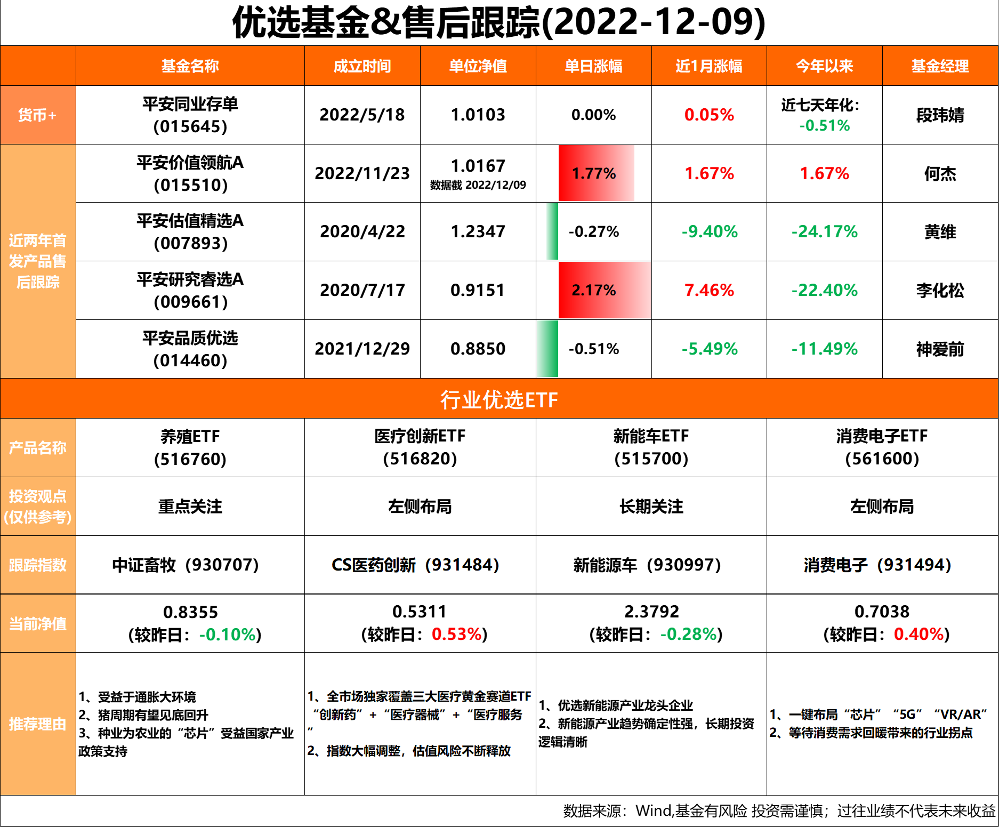

# Wind_Exporter_lite
 实习中使用的万得数据导出+日常推送生成工具
### 可选日期：默认获取今天的数据，如果为非工作日则跳过
### 自动在根目录生成已配置好的基金浏览器中内容(excel格式)
### 自动根据excel数据生成用于微信推送的内容

# 输出示例

# requirements
```
WindPy
chinesecalendar
pandas
python_dateutil
```
